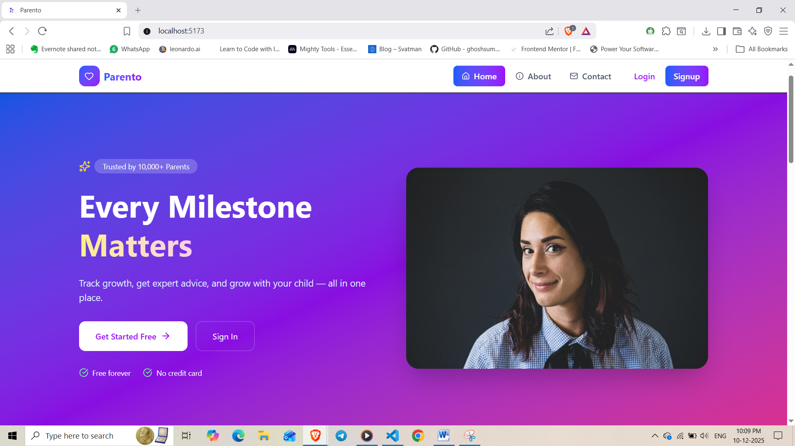
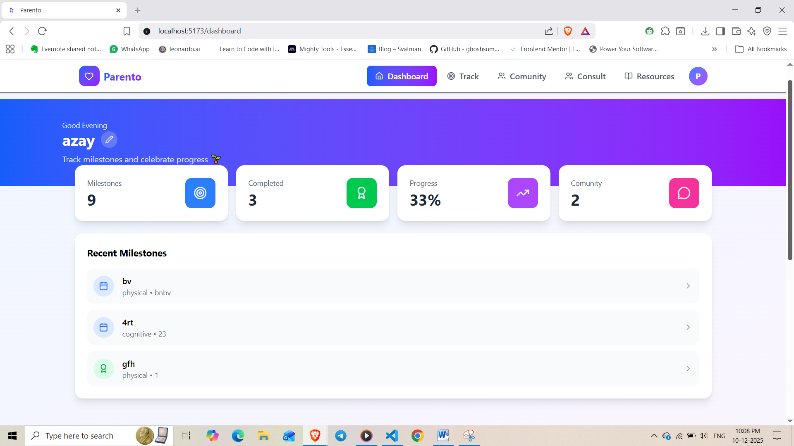
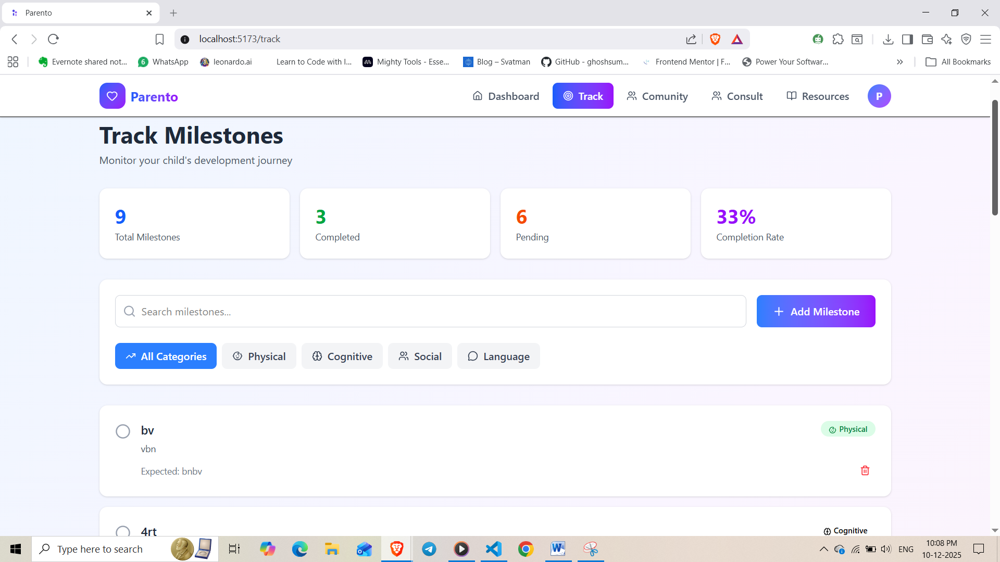
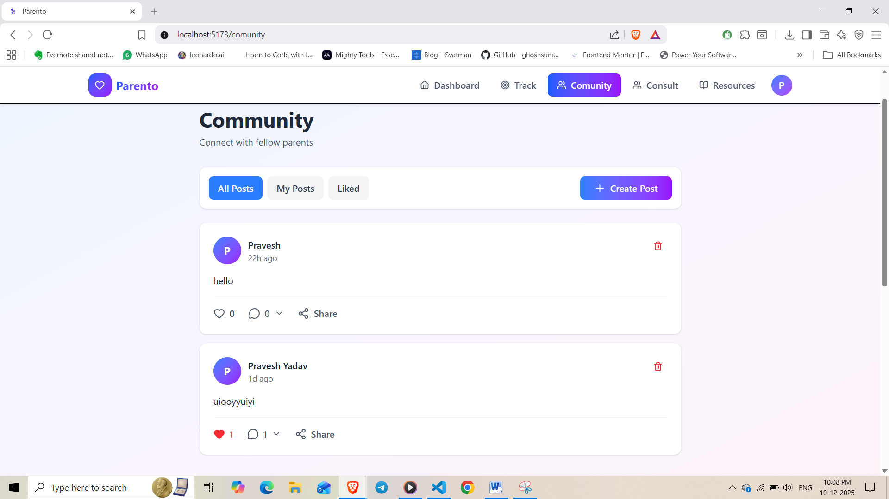
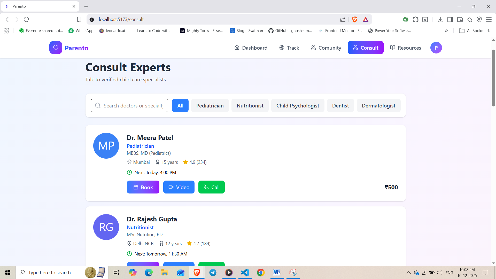
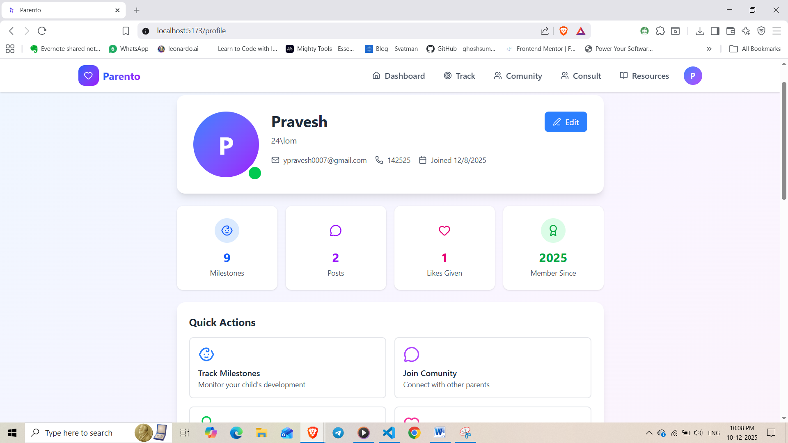

# 🍼 Parento - Modern Parenting Platform



[](https://opensource.org/licenses/MIT)
[](https://reactjs.org/)
[](https://firebase.google.com/)
[](https://tailwindcss.com/)

**Live Demo**: [https://parento.vercel.app](https://parento.vercel.app)

> A comprehensive full-stack web application designed to empower parents with tools for tracking child development, connecting with community, and accessing expert resources.

---

## 📖 Table of Contents

- [Overview](#overview)
- [Features](#features)
- [Tech Stack](#tech-stack)
- [Screenshots](#screenshots)
- [Installation](#installation)
- [Environment Variables](#environment-variables)
- [Firebase Setup](#firebase-setup)
- [Usage](#usage)
- [Project Structure](#project-structure)
- [Future Enhancements](#future-enhancements)
- [Contributing](#contributing)
- [License](#license)
- [Contact](#contact)

---

## 🎯 Overview

**Parento** is a modern parenting platform built with React, Firebase, and Tailwind CSS that helps parents:

- 📊 Track developmental milestones with personalized dashboards
- 👥 Connect with a supportive community of parents
- 📚 Access curated educational resources
- 🩺 Consult with pediatric specialists
- 🎯 Monitor progress with interactive charts and insights

The application provides an intuitive, mobile-responsive interface with smooth animations powered by Framer Motion, making parenting journey management both functional and delightful.

---

## ✨ Features

### 🔐 Authentication & User Management
- Email/password authentication
- Google OAuth integration
- Secure user sessions with Firebase Auth
- Protected routes and role-based access

### 📊 Dashboard
- Personalized activity feed
- Quick stats overview (milestones, posts, consultations)
- Recent milestone tracking
- Community activity highlights

### 🎯 Milestone Tracker
- Add, edit, and delete developmental milestones
- Category-based organization (Physical, Cognitive, Social, Language)
- Progress tracking with completion status
- Age-based milestone suggestions
- Search and filter functionality

### 👥 Community
- Create and share parenting experiences
- Like and comment on posts
- Real-time post updates
- Image sharing capabilities
- Supportive parent network

### 📚 Learning Hub
- Curated articles and resources
- Age-specific content
- Expert tips and guides
- Newsletter subscription

### 🩺 Doctor Consultation
- Browse verified pediatric specialists
- View doctor profiles and specialties
- Book consultations (coming soon)
- Review ratings and experience

### 📱 Responsive Design
- Mobile-first approach
- Desktop, tablet, and mobile optimized
- Bottom navigation for mobile
- Smooth page transitions

---

## 🛠️ Tech Stack

### Frontend
- **React 19** - UI framework
- **React Router DOM** - Client-side routing
- **Tailwind CSS 4** - Utility-first styling
- **Framer Motion** - Animations and transitions
- **Lucide React** - Modern icon library
- **Recharts** - Data visualization

### Backend & Database
- **Firebase Authentication** - User authentication
- **Cloud Firestore** - NoSQL database
- **Firebase Storage** - File storage (future)

### Development Tools
- **Vite** - Build tool and dev server
- **ESLint** - Code linting
- **PostCSS** - CSS processing
- **Git** - Version control

---

## 📸 Screenshots

### Home Page


### Dashboard


### Track Milestones


### Comunity


### Doctor Consultation


### User Profile


---

## 🚀 Installation

### Prerequisites
- Node.js (v18 or higher)
- npm or yarn
- Firebase account
- Git

### Steps

1. **Clone the repository**
```bash
git clone https://github.com/yourusername/parento.git
cd parento
```

2. **Install dependencies**
```bash
npm install
```

3. **Create environment file**
```bash
# Create .env file in project root
touch .env
```

4. **Add environment variables** (see [Environment Variables](#environment-variables))

5. **Start development server**
```bash
npm run dev
```

6. **Open in browser**
```
http://localhost:5173
```

---

## 🔑 Environment Variables

Create a `.env` file in the project root with the following variables:

```env
VITE_FIREBASE_API_KEY=your_api_key_here
VITE_FIREBASE_AUTH_DOMAIN=your_project_id.firebaseapp.com
VITE_FIREBASE_PROJECT_ID=your_project_id
VITE_FIREBASE_STORAGE_BUCKET=your_project_id.appspot.com
VITE_FIREBASE_MESSAGING_SENDER_ID=your_sender_id
VITE_FIREBASE_APP_ID=your_app_id
VITE_FIREBASE_MEASUREMENT_ID=your_measurement_id
```

⚠️ **Important**: Never commit the `.env` file to version control. It's already included in `.gitignore`.

### Getting Firebase Credentials

1. Go to [Firebase Console](https://console.firebase.google.com/)
2. Select your project or create a new one
3. Navigate to **Project Settings** (gear icon)
4. Scroll to **Your apps** section
5. Click on the web app or create one
6. Copy the configuration values

---

## 🔥 Firebase Setup

### 1. Create Firebase Project
```bash
1. Go to https://console.firebase.google.com/
2. Click "Add Project"
3. Enter project name: "parento"
4. Enable Google Analytics (optional)
5. Create project
```

### 2. Enable Authentication
```bash
1. In Firebase Console, go to "Authentication"
2. Click "Get Started"
3. Enable "Email/Password" provider
4. Enable "Google" provider
5. Add authorized domains
```

### 3. Create Firestore Database
```bash
1. Go to "Firestore Database"
2. Click "Create database"
3. Start in "production mode"
4. Choose database location
5. Click "Enable"
```

### 4. Add Security Rules
```javascript
// Go to Firestore → Rules tab
rules_version = '2';
service cloud.firestore {
  match /databases/{database}/documents {
    // Users collection
    match /users/{userId} {
      allow read: if request.auth != null;
      allow write: if request.auth != null && request.auth.uid == userId;
    }
    
    // Milestones collection
    match /milestones/{milestoneId} {
      allow read: if request.auth != null && resource.data.userId == request.auth.uid;
      allow create: if request.auth != null && request.resource.data.userId == request.auth.uid;
      allow update, delete: if request.auth != null && resource.data.userId == request.auth.uid;
    }
    
    // Posts collection
    match /posts/{postId} {
      allow read: if request.auth != null;
      allow create: if request.auth != null && request.resource.data.userId == request.auth.uid;
      allow update, delete: if request.auth != null && resource.data.userId == request.auth.uid;
    }
  }
}
```

### 5. Enable Storage (Optional)
```bash
1. Go to "Storage"
2. Click "Get Started"
3. Use default security rules
4. Click "Done"
```

---

## 📖 Usage

### Creating an Account
1. Click "Get Started" or "Sign Up"
2. Enter your details (name, email, password)
3. Or use "Continue with Google"
4. You'll be redirected to the dashboard

### Tracking Milestones
1. Navigate to "Track" page
2. Click "Add Milestone"
3. Fill in details (category, title, description, expected age)
4. Click "Add Milestone"
5. Toggle completion by clicking the checkbox

### Joining Community
1. Go to "Community" page
2. Click "Create Post"
3. Write your post and optionally add an image
4. Click "Post"
5. Like and comment on other posts

### Consulting Doctors
1. Visit "Consult" page
2. Browse available doctors
3. View profiles and specialties
4. Book consultation (feature coming soon)

---

## 📁 Project Structure

```
parento/
├── public/                 # Static assets
├── src/
│   ├── assets/            # Images, icons
│   ├── components/        # Reusable components
│   │   ├── BottomNav.jsx
│   │   ├── Footer.jsx
│   │   └── TopNav.jsx
│   ├── context/           # React Context
│   │   └── AuthContext.jsx
│   ├── firebase/          # Firebase configuration
│   │   └── firebase.jsx
│   ├── pages/             # Page components
│   │   ├── Community.jsx
│   │   ├── Consult.jsx
│   │   ├── Dashboard.jsx
│   │   ├── Home.jsx
│   │   ├── Learn.jsx
│   │   ├── Login.jsx
│   │   ├── Profile.jsx
│   │   ├── Signup.jsx
│   │   └── Track.jsx
│   ├── App.jsx            # Main app component
│   ├── main.jsx           # Entry point
│   └── index.css          # Global styles
├── .env                   # Environment variables (not in repo)
├── .gitignore
├── package.json
├── tailwind.config.js
├── vite.config.js
└── README.md
```

---

## 🚀 Future Enhancements

### Phase 1 (Current Sprint)
- [ ] Complete Community features (comments, shares)
- [ ] Image upload for posts and profiles
- [ ] Advanced milestone analytics
- [ ] Export milestone data as PDF

### Phase 2
- [ ] Real-time chat with doctors
- [ ] Payment integration for consultations
- [ ] Push notifications
- [ ] Mobile app (React Native)

### Phase 3
- [ ] AI-powered milestone predictions
- [ ] Personalized content recommendations
- [ ] Multi-language support
- [ ] Offline mode with sync

### Phase 4
- [ ] Video consultations
- [ ] Group chat for parents
- [ ] Marketplace for baby products
- [ ] Parenting courses and workshops

---

## 🤝 Contributing

Contributions are welcome! Here's how you can help:

1. **Fork the repository**
```bash
git clone https://github.com/yourusername/parento.git
```

2. **Create a feature branch**
```bash
git checkout -b feature/AmazingFeature
```

3. **Commit your changes**
```bash
git commit -m 'Add some AmazingFeature'
```

4. **Push to the branch**
```bash
git push origin feature/AmazingFeature
```

5. **Open a Pull Request**

### Coding Standards
- Follow ESLint configuration
- Use Tailwind CSS for styling
- Write meaningful commit messages
- Add comments for complex logic
- Update documentation for new features

---

## 📄 License

This project is licensed under the MIT License - see the [LICENSE](LICENSE) file for details.

---

## 📧 Contact

**Pravesh Yadav**  
GitHub: https://github.com/praveshnexus  

LinkedIn: https://www.linkedin.com/in/pravesh-yadav-a6536a207/ 

Project Link: 

---

## 🙏 Acknowledgments

- [React Documentation](https://react.dev/)
- [Firebase Documentation](https://firebase.google.com/docs)
- [Tailwind CSS](https://tailwindcss.com/)
- [Framer Motion](https://www.framer.com/motion/)
- [Lucide Icons](https://lucide.dev/)
- [Recharts](https://recharts.org/)

---

<div align="center">
  <p>Made with ❤️ by parents, for parents</p>
  <p>⭐ Star this repo if you find it helpful!</p>
</div>